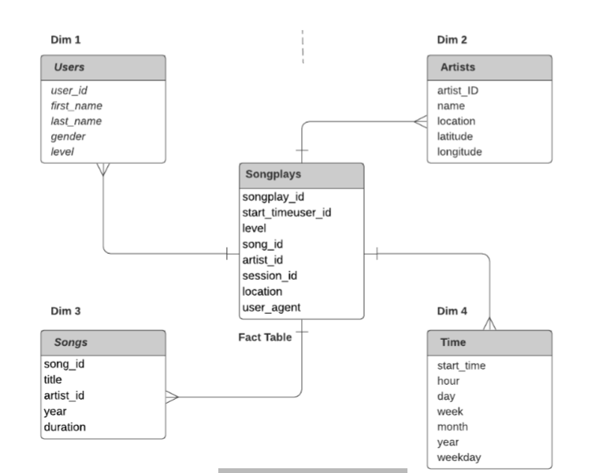
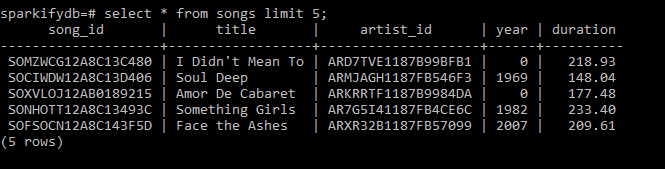
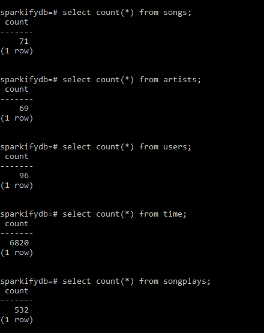

# Project Summary:
The goal of the project is to implement data modeling on a relational database i.e to extract data from json files, apply transformations and load into a database. The populated database can be consumed by various data dependent teams to perform analytics.  
- Input - > Json files (data/song_data & data/log_data)
- Schema - > STAR
- Database - > Postgres  

## Star Schema:
Schema consists of 1 fact table and 4 dimension tables. 

- Fact table: 
    - Table: songplays 
        - Columns: songplay_id, start_time, user_id, level, song_id, artist_id, session_id, location, user_agent
- Dimension tables:
    - Table: users 
        - Columns: user_id, first_name, last_name, gender, level
    - Table: songs
        - Columns: song_id, title, artist_id, year, duration
    - Table: artists
        - Columns: artist_ID, name, location, latitude, longitude
    - Table: time
        - Columns: start_time, hour, day, week, month, year, weekday

# How To Run:
Run files in the order as below:
1. sql_queries.py 
2. create_tables.py
3. etl.py
4. test.ipynb 

# Files In Repository:
- sql_queries.py: Contains list of queries needed to build an ETL pipeline.
- create_tables.py: Drop and recreate all tables in database 'sparkifydb'.
- etl.ipynb: Jupyter notebook to read 1 input json file, extract the contents and populate in individual tables.
- etl.py: Read all the input data i.e a list of json files, extract the contents and populate in individual tables.
- test.ipynb: Check the contents of all the tables.

# Sample Queries And Output:

