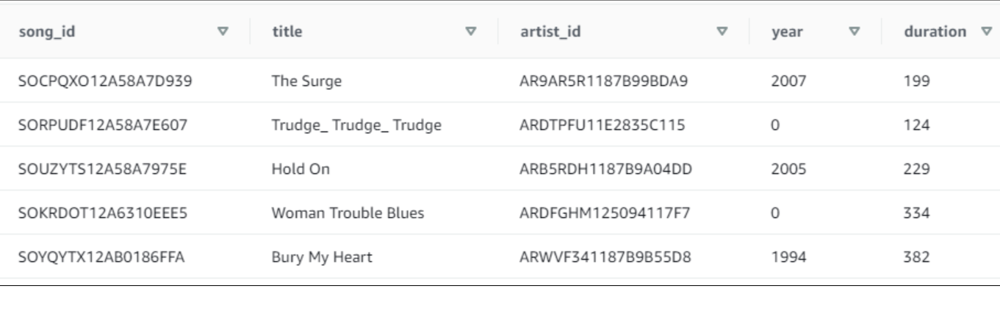
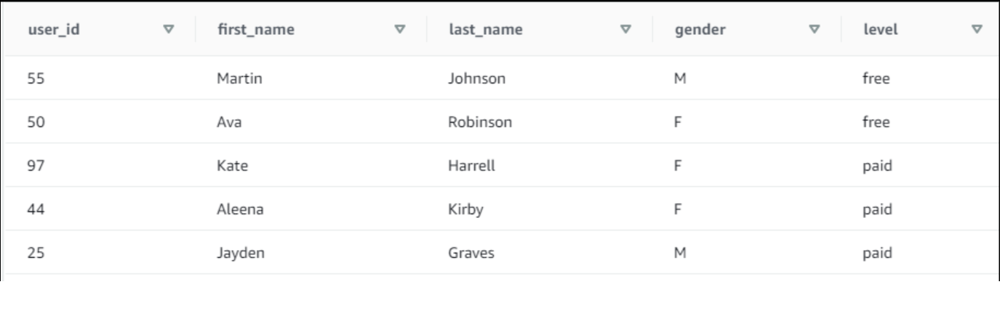

# Project Summary:
The goal of the project is to implement data modeling in AWS on a relational database. This includes copying data from S3 bucket into staging tables availalbe in EC2 instance. And then to extract data from staging, apply transformations and load into fact and dimension tables. The populated database can be consumed by various data dependent teams to perform analytics.  
- Input - > Json files (s3://udacity-dend/log-data and s3://udacity-dend/song-data)
- Schema - > STAR
- Database - > Postgres  

## Star Schema:
Schema consists of 2 staging tables, 1 fact table and 4 dimension tables. 

- Staging tables:
    - Table: staging_events
        - Columns: artist, auth, firstName, gender, itemInSession, lastName, length, level, location, method, page, registration, sessionId, song, status, ts, userAgent, userId
    - Table: staging_songs
        - Columns: num_songs, artist_id, artist_latitude, artist_longitude, artist_location, artist_name, song_id, title, duration, year
- Fact table: 
    - Table: songplays 
        - Columns: songplay_id, start_time, user_id, level, song_id, artist_id, session_id, location, user_agent
- Dimension tables:
    - Table: users 
        - Columns: user_id, first_name, last_name, gender, level
    - Table: songs
        - Columns: song_id, title, artist_id, year, duration
    - Table: artists
        - Columns: artist_ID, name, location, latitude, longitude
    - Table: time
        - Columns: start_time, hour, day, week, month, year, weekday

Prerequisites:
- Ensure to setup an EC2 instance that is configured with the required IAMRole (a min of S3ReadOnly access) using either Amazon Console or IAC (Infrastructure as Code using boto3 package in python).

# How To Run:
- Fill the data ware house configuration details in dwh.cfg.
- Then, run the files in the order as below:
    1. sql_queries.py 
    2. create_tables.py
    3. etl.py

# Files In Repository:
- sql_queries.py: Contains list of queries needed to build an ETL pipeline.
- create_tables.py: Drop and recreate all tables in database 'sparkifydb'.
- etl.py: Use 'copy' command to read data from S3 storage and place it in staging tables (staging_songs and staging_events) available in EC2 instance. Then use the staging tables to extract the data, transform and load into dimension tables.

# Sample Queries And Output:
## select Top 5 * from songs;

## select Top 5 * from users;
