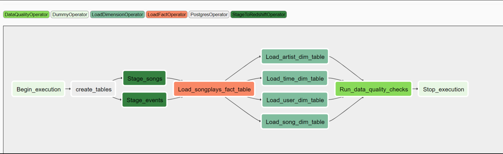

# Data Lake with Apache Spark

# Project Introduction:

- A music streaming company, Sparkify, has decided that it is time to introduce more automation and monitoring to their data warehouse ETL pipelines and come to the conclusion that the best tool to achieve this is to use **"Apache Airflow"**.

- Idea is to **create high grade data pipelines** that are dynamic and built from reusable tasks, can be monitored, and allow easy backfills. Data quality plays a big part when analyses are executed on top of the data warehouse and want to run tests against datasets after the ETL steps have been executed to catch any discrepancies in the datasets.

- The source data resides in **S3** and needs to be processed in the data warehouse in **Amazon Redshift**. The source datasets consist of JSON logs that tell about user activity in the application and JSON metadata about the songs the users listen to.

- **Custom operators in Airflow** have been built to perform tasks such as staging the data into staging tables, filling the fact and dimension tables, and running data quality checks as the final step.

- Resultant Directed Acyclic Graph (**DAG**) looks like below:

    - Input  - > Json files (s3://udacity-dend/log_data and s3://udacity-dend/song_data)
    - Schema - > STAR
    - Output - > Database in Amazon Redshift   

## Star Schema:
Schema consists of 1 fact table and 4 dimension tables. 

- Fact table: 
    - Table: songplays 
        - Columns: songplay_id, start_time, user_id, level, song_id, artist_id, session_id, location, user_agent
- Dimension tables:
    - Table: users 
        - Columns: user_id, first_name, last_name, gender, level
    - Table: songs
        - Columns: song_id, title, artist_id, year, duration
    - Table: artists
        - Columns: artist_ID, name, location, latitude, longitude
    - Table: time
        - Columns: start_time, hour, day, week, month, year, weekday

# Prerequisites:

- Ensure the following connections are setup using Airflow UI.
    - aws_credentials: Provide the following parameters
        - Conn Id, Conn Type, Login, Password
    - redshift: Provide the following 
        - Conn Id, Conn Type, Host, Schema, Login, Password, Port
- Ensure Airflow server is up and running.

# How To Run:
- Run the following command in Airflow terminal: /opt/airflow/start.sh
- In the window with Airflow UI, navigate to the DAG and enable it. Click on the 'Trigger Dag' button.
- Navigate to the **Graph view of the DAG**. Choose any component and click on 'View Logs' button to check the logs if needed. 

# Files In Repository:
- Major files in the project include:
    1. **udac_example_dag.py** under the **dags** directory. 
    2. Following custom plugins available under **plugins\operators** directory:
        - stage_redshift.py, load_fact.py, load_dimension.py and data_quality.py
    3. README.md 
