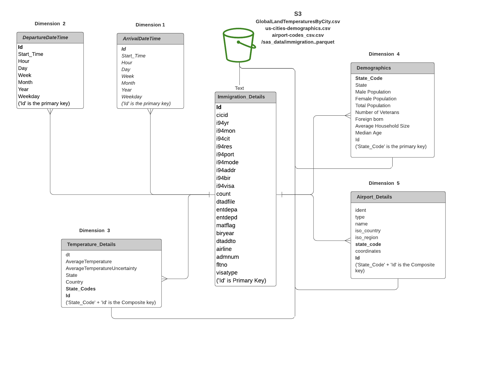

# Immigration Data Pipeline
## **Data Engineering Capstone Project**

### **Project Summary:**
The aim of the project is to work on big data sets obtained from large open source data bases and build a reusable data pipeline that can be consumed by any downstream Analytics teams.

The data used in the project meets the following criteria that is assumed to be a good starting point:
- At least 2 data sources
- More than 1 million lines of data.
- At least two data sources/formats (csv, api, json)

The project follows the follow steps:
* Step 1: Scope the Project and Gather Data
* Step 2: Explore and Assess the Data
* Step 3: Define the Data Model
* Step 4: Run ETL to Model the Data
* Step 5: Complete Project Write Up

### **Step 1: Scope the Project and Gather Data**

### Scope 
- The aim of the project is to build clean data set through a pipeline that can be utilized to answer questions such as:  
    - What kind of states and demographics that immigrants choose to live ?
    - What are the top  airports that are used by immigrants ? Which states are these airports located ?
    - How does temperature influence immigration ?
    
- The output of the pipeline is a series of parquet files that can then be consumed by analytics teams in downstream.
- A resultant Star schema database system can be imagined where Immigration_Details is the Fact table and [ArrivalDateTime, DepartureDateTime, Airport_Details, Demographics] are the dimension tables. 

### Describe and Gather Data 
- I94 Immigration Data: This data comes from the US National Tourism and Trade Office. A data dictionary 'I94_SAS_Labels_Descriptions.SAS' is included that describes the data in more detail.The data is obtained from the link: https://travel.trade.gov/research/reports/i94/historical/2016.html
- World Temperature Data: This dataset came from Kaggle. Link: https://www.kaggle.com/berkeleyearth/climate-change-earth-surface-temperature-data
- U.S. City Demographic Data: This data comes from OpenSoft. Link: https://public.opendatasoft.com/explore/dataset/us-cities-demographics/export/
- Airport Code Table: This is a simple table of airport codes and corresponding cities. Link: https://datahub.io/core/airport-codes#data

### **Step 2: Explore and Assess the Data**
- The task here is to read all the data sets and identify count of missing values for each column of data set.
- Aim is to remove rows/columns with nulls while retaining as much data as possible. 
- If missing value count for any column is greater than 5% of the length of data set, those columns are noted down and dropped as seen in notebook 'DECapstoneProjectNotebook_1.ipynb'. 
- Finally, if any additional nulls are identified in the rows, only those rows are removed.  
Refer notebook 'Capstone Project Template.ipynb'.

### **Step 3: Define the Data Model**
The data model can be imagined as a star schema with the following structure:

- Immigration_Details: Fact Table 
    - ['cicid', 'i94yr', 'i94mon', 'i94cit', 'i94res', 'i94port', 'i94mode', 'i94addr', 'i94bir', 'i94visa', 'count', 'dtadfile', 'entdepa', 'entdepd', 'matflag', 'biryear', 'dtaddto', 'airline', 'admnum', 'fltno', 'visatype', 'Id'].
    - 'Id' is the primary key.

- ArrivalDateTime : Dimension Table 
    - ['Id', 'Start_Time', 'Hour', 'Day', 'Week', 'Month', 'Year', 'Weekday'].
    - 'Id' is the primary key.

- DepartureDateTime: Dimension Table 
    - ['Id', 'Start_Time', 'Hour', 'Day', 'Week', 'Month', 'Year', 'Weekday'].
    - 'Id' is the primary key.

- Demographics: Dimension Table 
    - ['State_Code', 'State', 'Male_Population', 'Female_Population', 'Total_Population', 'Number_of_Veterans', 'Foreign_Born', 'Average_Household_Size', 'Median_Age', 'Id'].
    - 'State_Code' is the primary key.

- Temperature_Details: Dimension Table 
    - ['dt', 'AverageTemperature', 'AverageTemperatureUncertainty', 'State', 'Country', 'State_Codes', 'Id'].
    - 'State_Code' + 'Id' is the Composite key.

- Airport_Details: Dimension Table 
    - [ident', 'type', 'name', 'iso_country', 'iso_region', 'state_code', 'coordinates', 'Id']
    - 'state_code' + 'Id' is the Composite key.

#### Mapping:
- 'Id' in Immigration_Details maps to 'Id' in ArrivalDateTime.
- 'Id' in Immigration_Details maps to 'Id' in DepartureDateTime.
- 'i94addr' in Immigration_Details maps to 'State_Code' in Demographics.
- 'i94addr' in Immigration_Details maps to 'State_Code' in Temperature_Details.
- 'i94addr' in Immigration_Details maps to 'State_Code' in Airport_Details.

### **Step 4: Run Pipelines to Model the Data** 
### 4.1 Create the data model
- Refer notebook 'DECapstoneProjectNotebook_1.ipynb' 

### 4.2 Data Quality Checks
The following 3 quality checks have been included for each of the resulting spark data frames before converting them into parquet format files:
- Check the number of rows to be greater than 0.
- Check the number of columns to be greater than 0.
- Check the input is of pyspark data type.

### 4.3 Data dictionary 
- refer I94_SAS_Labels_Descriptions.SAS

### **Step 5: Complete Project Write Up**
### AWS Ecosystem
- This includes S3, EMR cluster with multiple EC2's along with pyspark library. All of these have been utilized to execute the pipeline. 
- Spark has been chosen as it can be 100x faster than Hadoop for large scale data processing by exploiting in memory computing. Also its easy to use and comes packaged with higher-level libraries, including support for SQL queries.

- AWS EMR has been chosen as its easy to use, provides cluster in minutes and scale resources to meet business needs.

- Star Schema has been chosen as it does not require complex joins when querying data. So, accessing data is faster. Also, it provides simplicity to drive business insights.

- The pipeline should run periodically to meet the needs of downstream teams. As the immigration dataset is updated monthly, the pipeline can be run once a month.
- Approaching the problem under the following scenarios:
    * The data was increased by 100x.
        - Since the pipeline can be run on AWS with EMR cluster, machines scale automatically to meet the increasing data levels as needed. However, if run locally, it would be impossible without additonal hardware.
    * The data populates a dashboard that must be updated on a daily basis by 7am every day.
        - Airflow can be incorporated and suits best for the task to orchestrate the pipeline for cron jobs.
    * The database needed to be accessed by 100+ people.
        - Redshift with auto-scaling capabilities is a good choice for the task.

# Prerequisites:

- Ensure to setup EMR cluster with multiple EC2 instances and auto scaling enabled. 
- Ensure spark is installed and running in the cluster.
- Ensure to upload data needed for the project to a S3 bucket accessible to the cluster.  

# How To Run:
- Run the notebook 'DECapstoneProjectNotebook.ipynb' from the cluster. 

# Files In Repository:
1. Notebook 'DECapstoneProjectNotebook_1.ipynb'. 
2. Notebook 'Capstone Project Template.ipynb.'
3. AWS credentials file 'dl.cfg'.
4. Data dictionary file 'I94_SAS_Labels_Descriptions.SAS'
5. README.md 
